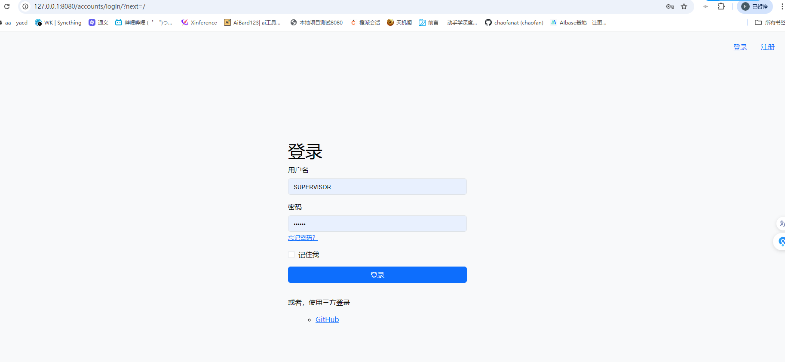

# django-project-template

一个django项目启动模板。

集成了django-allauth、django-allauth-bootstrap5、simpleui、django-ninja、django-ninja-jwt等django适配的应用，用于提供一个基础设施更加完善的django项目启动模板。

项目模板功能

- [X] 账户相关功能界面美化。基于django-allauth-bootstrap5。
- [X] 三方登录集成。基于django-allauth。
- [X] 后台管理界面美化。基于simpleui。
- [X] api开发集成。基于django-ninja。
- [X] api登录JWT认证。基于django-ninja-jwt.
- [X] 集成django框架实时分析和检查工具。基于django-silk

其他：

* [X] 建立了templates文件夹，用于管理所有前端页面。
* [X] 建立了locale文件夹，用于管理项目语言本地化。
* [X] 建立appIndex应用，作为项目初始主页以及示例。
* [X] 配置vscode调试launch.json文件
* [X] 完成了三方适配应用的相关开箱即用的初始配置。

# 使用方法

1. 将项目拉到本地

```cmake
    git clone https://github.com/chaofanat/django-projecet-template.git
```

2. 安装依赖

   ```cmake
   pip install -r requirements.txt
   ```
3. 数据库迁移

   ```cmake
   python manage.py makemigrations
   python manage.py migrate
   ```
4. 创建超级用户

   ```cmake
   python manage.py createsuperuser
   ```
5. 配置邮箱相关配置

   ```python
   # email
   #邮件配置,需要去三方邮箱开启授权服务
   # EMAIL_BACKEND = 'django.core.mail.backends.smtp.EmailBackend'
   EMAIL_HOST = 'smtp.qq.com'  # 如果是 163 改成 smtp.163.com
   EMAIL_PORT = 465
   EMAIL_HOST_USER = 'chaofanat@qq.com'  # 发送邮件的邮箱帐号
   EMAIL_HOST_PASSWORD = 'abcderfetg'  # 授权码,各邮箱的设置中启用smtp服务时获取
   DEFAULT_FROM_EMAIL = EMAIL_HOST_USER  #收件人显示发件人的邮箱
   # DEFAULT_FROM_EMAIL = '<xxxxx@qq.com>' #也可以随意写
   EMAIL_USE_SSL = True   # 使用ssl
   # EMAIL_USE_TLS = False # 使用tls
   # EMAIL_USE_SSL 和 EMAIL_USE_TLS 是互斥的，即只能有一个为 True
   ```
6. 启动服务

   ```cmake
   python manage.py runserver 0.0.0.0:8080
   ```
7. 登录管理界面，添加三方登录

   

# 效果展示





